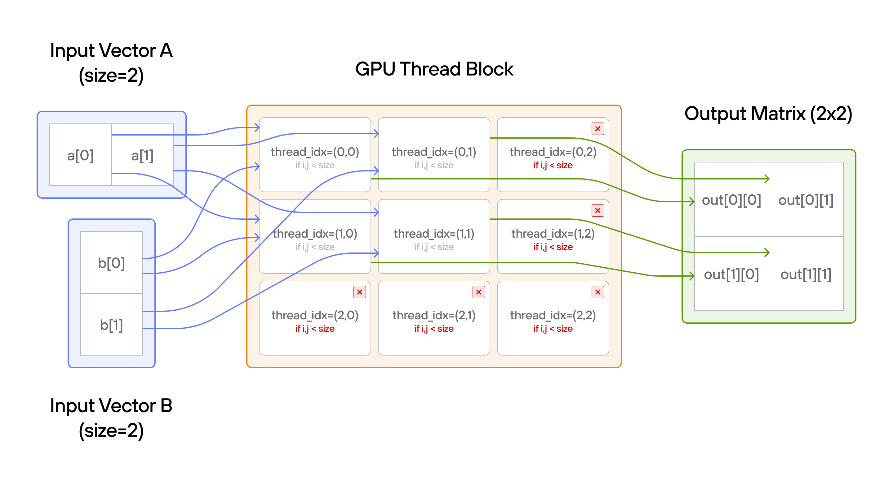
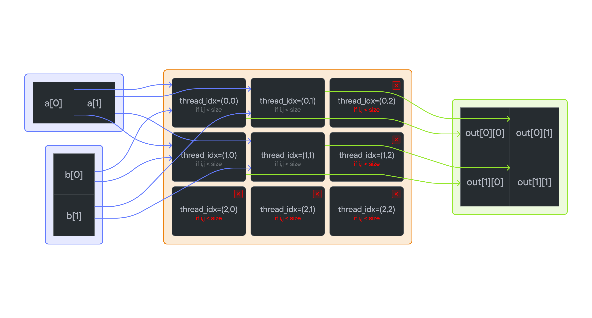

# Puzzle 5: Broadcast

## Overview

Implement a kernel that broadcast adds 1D TileTensor `a` and 1D TileTensor `b` and stores it in 2D TileTensor `output`.

**Broadcasting** in parallel programming refers to the operation where lower-dimensional arrays are automatically expanded to match the shape of higher-dimensional arrays during element-wise operations. Instead of physically replicating data in memory, values are logically repeated across the additional dimensions. For example, adding a 1D vector to each row (or column) of a 2D matrix applies the same vector elements repeatedly without creating multiple copies.

**Note:** _You have more threads than positions._




## Key concepts

In this puzzle, you'll learn about:

- Broadcasting 1D vectors across different dimensions with `TileTensor`
- Using 2D thread indices to map GPU threads to a 2D output matrix
- Working with different tensor shapes for mixed-dimension operations
- Handling boundary conditions in broadcast patterns

The key insight is that `TileTensor` allows natural broadcasting through different tensor shapes: \\((1, n)\\) and \\((n, 1)\\) to \\((n,n)\\), while still requiring bounds checking.

- **Tensor shapes**: Input vectors have shapes \\((1, n)\\) and \\((n, 1)\\)
- **Broadcasting**: Each element of `a` combines with each element of `b`; output expands both dimensions to \\((n,n)\\)
- **Access patterns**: `a[0, col]` broadcasts horizontally across rows; `b[row, 0]` broadcasts vertically across columns
- **Guard condition**: Still need bounds checking for output size
- **Thread bounds**: More threads \\((3 \times 3)\\) than tensor elements \\((2 \times 2)\\)

## Code to complete

```mojo
{{#include ../../../problems/p05/p05.mojo:broadcast_add}}
```

<a href="{{#include ../_includes/repo_url.md}}/blob/main/problems/p05/p05.mojo" class="filename">View full file: problems/p05/p05.mojo</a>

<details>
<summary><strong>Tips</strong></summary>

<div class="solution-tips">

1. Get 2D indices: `row = thread_idx.y`, `col = thread_idx.x`
2. Add guard: `if row < size and col < size`
3. Inside guard: think about how to broadcast values of `a` and `b` as TileTensors

</div>
</details>

## Running the code

To test your solution, run the following command in your terminal:

<div class="code-tabs" data-tab-group="package-manager">
  <div class="tab-buttons">
    <button class="tab-button">pixi NVIDIA (default)</button>
    <button class="tab-button">pixi AMD</button>
    <button class="tab-button">pixi Apple</button>
    <button class="tab-button">uv</button>
  </div>
  <div class="tab-content">

```bash
pixi run p05
```

  </div>
  <div class="tab-content">

```bash
pixi run -e amd p05
```

  </div>
  <div class="tab-content">

```bash
pixi run -e apple p05
```

  </div>
  <div class="tab-content">

```bash
uv run poe p05
```

  </div>
</div>

Your output will look like this if the puzzle isn't solved yet:

```txt
out: HostBuffer([0.0, 0.0, 0.0, 0.0])
expected: HostBuffer([1.0, 2.0, 11.0, 12.0])
```

## Solution

<details class="solution-details">
<summary></summary>

```mojo
{{#include ../../../solutions/p05/p05.mojo:broadcast_add_solution}}
```

<div class="solution-explanation">

This solution demonstrates key concepts of TileTensor broadcasting and GPU thread mapping:

1. **Thread to matrix mapping**

   - Uses `thread_idx.y` for row access and `thread_idx.x` for column access
   - Natural 2D indexing matches the output matrix structure
   - Excess threads (3×3 grid) are handled by bounds checking

2. **Broadcasting mechanics**
   - Input `a` has shape `(1,n)`: `a[0,col]` broadcasts across rows
   - Input `b` has shape `(n,1)`: `b[row,0]` broadcasts across columns
   - Output has shape `(n,n)`: Each element is sum of corresponding broadcasts

   ```txt
   [ a0 a1 ]  +  [ b0 ]  =  [ a0+b0  a1+b0 ]
                 [ b1 ]     [ a0+b1  a1+b1 ]
   ```

3. **Bounds Checking**
   - Guard condition `row < size and col < size` prevents out-of-bounds access
   - Handles both matrix bounds and excess threads efficiently
   - No need for separate checks for `a` and `b` due to broadcasting

This pattern forms the foundation for more complex tensor operations we'll explore in later puzzles.
</div>
</details>
