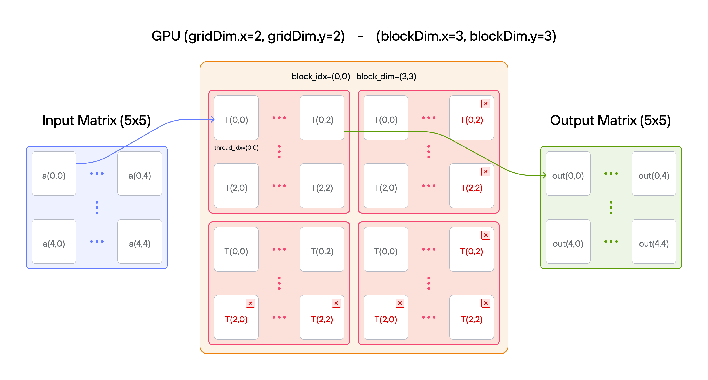
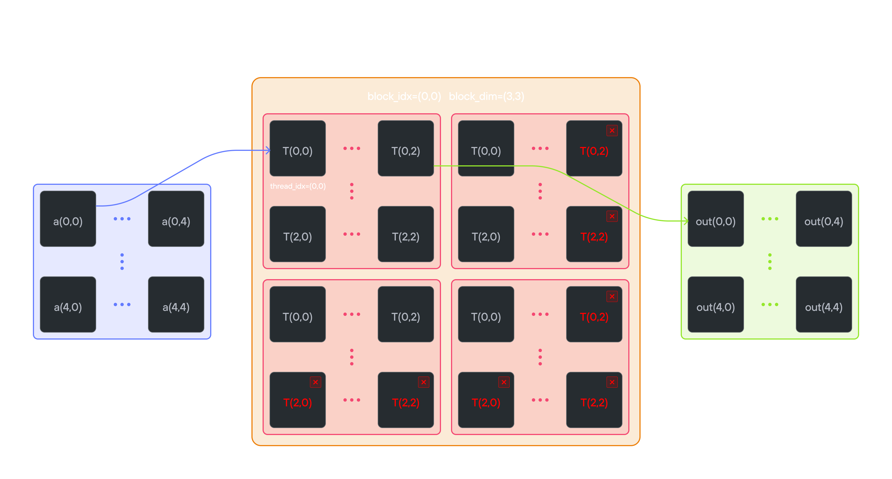

# Puzzle 7: 2D Blocks

## Overview

Implement a kernel that adds 10 to each position of 2D TileTensor `a` and stores it in 2D TileTensor `output`.

**Note:** _You have fewer threads per block than the size of `a` in both directions._




## Key concepts

In this puzzle, you'll learn about:

- Using `TileTensor` with multiple blocks
- Handling large matrices with 2D block organization
- Combining block indexing with `TileTensor` access

The key insight is that `TileTensor` simplifies 2D indexing while still requiring proper block coordination for large matrices.

> 🔑 **2D thread indexing convention**
>
> We extend the block-based indexing from [puzzle 4](../puzzle_04/puzzle_04.md) to 2D:
>
> ```txt
> Global position calculation:
> row = block_dim.y * block_idx.y + thread_idx.y
> col = block_dim.x * block_idx.x + thread_idx.x
> ```
>
> For example, with 2×2 blocks in a 4×4 grid:
> ```txt
> Block (0,0):   Block (1,0):
> [0,0  0,1]     [0,2  0,3]
> [1,0  1,1]     [1,2  1,3]
>
> Block (0,1):   Block (1,1):
> [2,0  2,1]     [2,2  2,3]
> [3,0  3,1]     [3,2  3,3]
> ```
>
> Each position shows (row, col) for that thread's global index.
> The block dimensions and indices work together to ensure:
> - Continuous coverage of the 2D space
> - No overlap between blocks
> - Efficient memory access patterns

## Configuration

- **Matrix size**: \\(5 \times 5\\) elements
- **Layout handling**: `TileTensor` manages row-major organization
- **Block coordination**: Multiple blocks cover the full matrix
- **2D indexing**: Natural \\((i,j)\\) access with bounds checking
- **Total threads**: \\(36\\) for \\(25\\) elements
- **Thread mapping**: Each thread processes one matrix element

## Code to complete

```mojo
{{#include ../../../problems/p07/p07.mojo:add_10_blocks_2d}}
```

<a href="{{#include ../_includes/repo_url.md}}/blob/main/problems/p07/p07.mojo" class="filename">View full file: problems/p07/p07.mojo</a>

<details>
<summary><strong>Tips</strong></summary>

<div class="solution-tips">

1. Calculate global indices: `row = block_dim.y * block_idx.y + thread_idx.y`, `col = block_dim.x * block_idx.x + thread_idx.x`
2. Add guard: `if row < size and col < size`
3. Inside guard: think about how to add 10 to 2D TileTensor

</div>
</details>

## Running the code

To test your solution, run the following command in your terminal:

<div class="code-tabs" data-tab-group="package-manager">
  <div class="tab-buttons">
    <button class="tab-button">pixi NVIDIA (default)</button>
    <button class="tab-button">pixi AMD</button>
    <button class="tab-button">pixi Apple</button>
    <button class="tab-button">uv</button>
  </div>
  <div class="tab-content">

```bash
pixi run p07
```

  </div>
  <div class="tab-content">

```bash
pixi run -e amd p07
```

  </div>
  <div class="tab-content">

```bash
pixi run -e apple p07
```

  </div>
  <div class="tab-content">

```bash
uv run poe p07
```

  </div>
</div>

Your output will look like this if the puzzle isn't solved yet:

```txt
out: HostBuffer([0.0, 0.0, 0.0, ... , 0.0])
expected: HostBuffer([10.0, 11.0, 12.0, ... , 34.0])
```

## Solution

<details class="solution-details">
<summary></summary>

```mojo
{{#include ../../../solutions/p07/p07.mojo:add_10_blocks_2d_solution}}
```

<div class="solution-explanation">

This solution demonstrates how TileTensor simplifies 2D block-based processing:

1. **2D thread indexing**
   - Global row: `block_dim.y * block_idx.y + thread_idx.y`
   - Global col: `block_dim.x * block_idx.x + thread_idx.x`
   - Maps thread grid to tensor elements:

     ```txt
     5×5 tensor with 3×3 blocks:

     Block (0,0)         Block (1,0)
     [(0,0) (0,1) (0,2)] [(0,3) (0,4)    *  ]
     [(1,0) (1,1) (1,2)] [(1,3) (1,4)    *  ]
     [(2,0) (2,1) (2,2)] [(2,3) (2,4)    *  ]

     Block (0,1)         Block (1,1)
     [(3,0) (3,1) (3,2)] [(3,3) (3,4)    *  ]
     [(4,0) (4,1) (4,2)] [(4,3) (4,4)    *  ]
     [  *     *     *  ] [  *     *      *  ]
     ```

     (* = thread exists but outside tensor bounds)

2. **TileTensor benefits**
   - Natural 2D indexing: `tensor[row, col]` instead of manual offset calculation
   - Automatic memory layout optimization
   - Example access pattern:

     ```txt
     Raw memory:         TileTensor:
     row * size + col    tensor[row, col]
     (2,1) -> 11        (2,1) -> same element
     ```

3. **Bounds checking**
   - Guard `row < size and col < size` handles:
     - Excess threads in partial blocks
     - Edge cases at tensor boundaries
     - Automatic memory layout handling by TileTensor
     - 36 threads (2×2 blocks of 3×3) for 25 elements

4. **Block coordination**
   - Each 3×3 block processes part of 5×5 tensor
   - TileTensor handles:
     - Memory layout optimization
     - Efficient access patterns
     - Block boundary coordination
     - Cache-friendly data access

This pattern shows how TileTensor simplifies 2D block processing while maintaining optimal memory access patterns and thread coordination.
</div>
</details>
