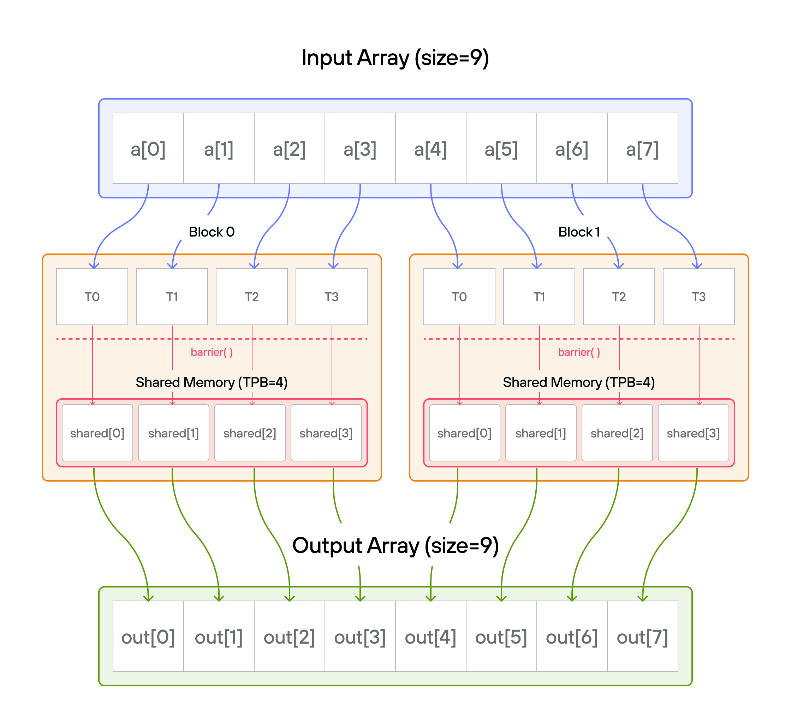
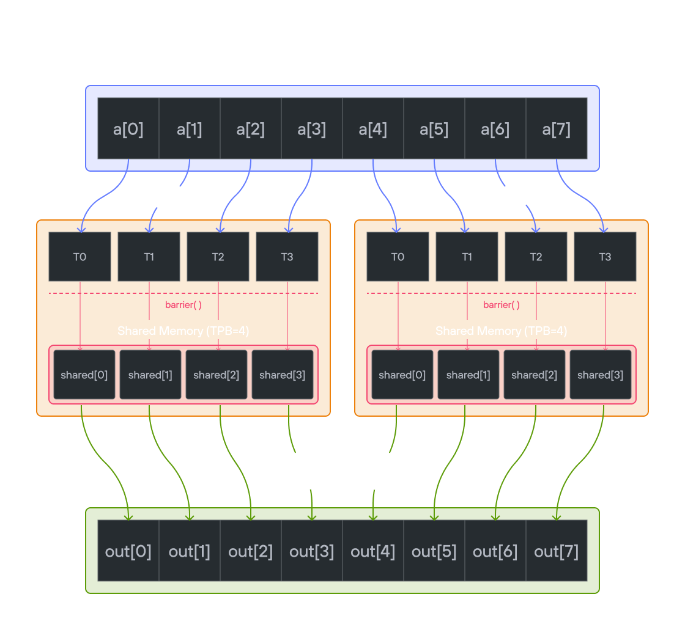

# Puzzle 8: Shared Memory

## Overview

Implement a kernel that adds 10 to each position of a 1D TileTensor `a` and stores it in 1D TileTensor `output`.

**Shared memory** is fast, on-chip storage that is visible to all threads within the same block. Unlike global memory (which all blocks can access but is slow), shared memory has latency similar to a CPU register cache. Each block gets its own private shared memory region — threads in one block cannot see the shared memory of another block. Because threads can read and write to the same shared memory locations, coordination via `barrier()` is required to prevent one thread from reading a value before another thread has finished writing it.

**Note:** _You have fewer threads per block than the size of `a`._




## Key concepts

In this puzzle, you'll learn about:

- Using TileTensor's shared memory features with address_space
- Thread synchronization with shared memory
- Block-local data management with TileTensor

The key insight is how TileTensor simplifies shared memory management while maintaining the performance benefits of block-local storage.

## Configuration

- Array size: `SIZE = 8` elements
- Threads per block: `TPB = 4`
- Number of blocks: 2
- Shared memory: `TPB` elements per block

> **Warning**: Each block can only have a _constant_ amount of shared memory that threads in that block can read and write to. This needs to be a literal python constant, not a variable. After writing to shared memory you need to call [barrier](https://docs.modular.com/mojo/std/gpu/sync/sync/barrier/) to ensure that threads do not cross.

**Educational Note**: In this specific puzzle, the `barrier()` isn't strictly necessary since each thread only accesses its own shared memory location. However, it's included to teach proper shared memory synchronization patterns for more complex scenarios where threads need to coordinate access to shared data.

## Code to complete

```mojo
{{#include ../../../problems/p08/p08.mojo:add_10_shared}}
```

<a href="{{#include ../_includes/repo_url.md}}/blob/main/problems/p08/p08.mojo" class="filename">View full file: problems/p08/p08.mojo</a>

<details>
<summary><strong>Tips</strong></summary>

<div class="solution-tips">

1. Create shared memory with TileTensor using address_space parameter
2. Load data with natural indexing: `shared[local_i] = a[global_i]`
3. Synchronize with `barrier()` (educational - not strictly needed here)
4. Process data using shared memory indices
5. Guard against out-of-bounds access

</div>
</details>

## Running the code

To test your solution, run the following command in your terminal:

<div class="code-tabs" data-tab-group="package-manager">
  <div class="tab-buttons">
    <button class="tab-button">pixi NVIDIA (default)</button>
    <button class="tab-button">pixi AMD</button>
    <button class="tab-button">pixi Apple</button>
    <button class="tab-button">uv</button>
  </div>
  <div class="tab-content">

```bash
pixi run p08
```

  </div>
  <div class="tab-content">

```bash
pixi run -e amd p08
```

  </div>
  <div class="tab-content">

```bash
pixi run -e apple p08
```

  </div>
  <div class="tab-content">

```bash
uv run poe p08
```

  </div>
</div>

Your output will look like this if the puzzle isn't solved yet:

```txt
out: HostBuffer([0.0, 0.0, 0.0, 0.0, 0.0, 0.0, 0.0, 0.0])
expected: HostBuffer([11.0, 11.0, 11.0, 11.0, 11.0, 11.0, 11.0, 11.0])
```

## Solution

<details class="solution-details">
<summary></summary>

```mojo
{{#include ../../../solutions/p08/p08.mojo:add_10_shared_solution}}
```

<div class="solution-explanation">

This solution demonstrates how TileTensor simplifies shared memory usage while maintaining performance:

1. **Memory hierarchy with TileTensor**
   - Global tensors: `a` and `output` (slow, visible to all blocks)
   - Shared tensor: `shared` (fast, thread-block local)
   - Example for 8 elements with 4 threads per block:

     ```txt
     Global tensor a: [1 1 1 1 | 1 1 1 1]  # Input: all ones

     Block (0):         Block (1):
     shared[0..3]       shared[0..3]
     [1 1 1 1]          [1 1 1 1]
     ```

2. **Thread coordination**
   - Load phase with natural indexing:

     ```txt
     Thread 0: shared[0] = a[0]=1    Thread 2: shared[2] = a[2]=1
     Thread 1: shared[1] = a[1]=1    Thread 3: shared[3] = a[3]=1
     barrier()    ↓         ↓        ↓         ↓   # Wait for all loads
     ```

   - Process phase: Each thread adds 10 to its shared tensor value
   - Result: `output[global_i] = shared[local_i] + 10 = 11`

   **Note**: In this specific case, the `barrier()` isn't strictly necessary since each thread only writes to and reads from its own shared memory location (`shared[local_i]`). However, it's included for educational purposes to demonstrate proper shared memory synchronization patterns that are essential when threads need to access each other's data.

3. **TileTensor benefits**
   - Shared memory allocation:

     ```txt
     # Clean TileTensor API with address_space
     shared = stack_allocation[dtype=dtype, address_space=AddressSpace.SHARED](row_major[TPB]())
     ```

   - Natural indexing for both global and shared:

     ```txt
     Block 0 output: [11 11 11 11]
     Block 1 output: [11 11 11 11]
     ```

   - Built-in layout management and type safety

4. **Memory access pattern**
   - Load: Global tensor → Shared tensor (optimized)
   - Sync: Same `barrier()` requirement as raw version
   - Process: Add 10 to shared values
   - Store: Write 11s back to global tensor

This pattern shows how TileTensor maintains the performance benefits of shared memory while providing a more ergonomic API and built-in features.
</div>
</details>
