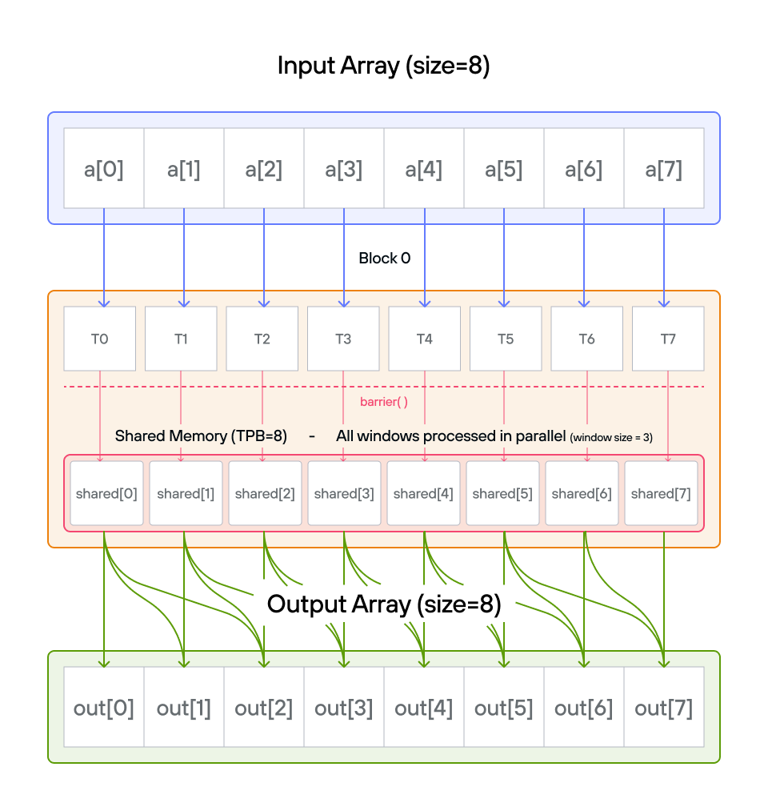
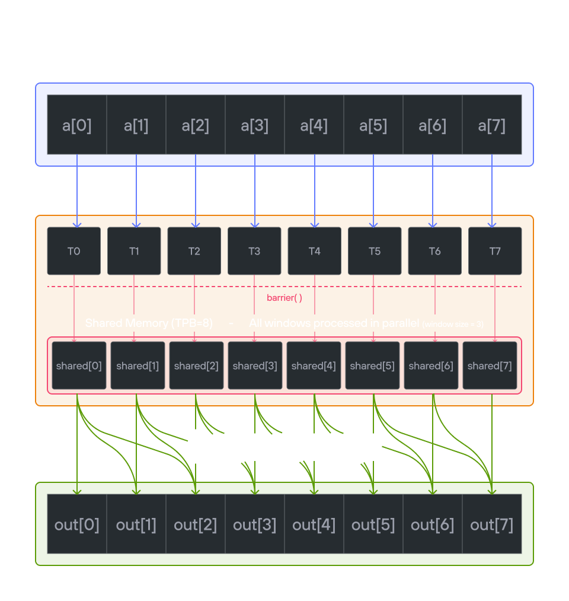

# Puzzle 11: Pooling

## Overview

Implement a kernel that compute the running sum of the last 3 positions of 1D TileTensor `a` and stores it in 1D TileTensor `output`.

**Pooling** is an operation that condenses a region of values into a single summary value — for example, their sum, maximum, or average. A **sliding window** applies this condensation repeatedly by moving a fixed-size window one step at a time across the input, producing one output value per window position. Here the window is 3 elements wide and the summary function is a sum, so each output element equals the sum of the current element and the two preceding it (with special cases at the boundaries where fewer than 3 elements are available).

**Note:** _You have 1 thread per position. You only need 1 global read and 1 global write per thread._




## Key concepts

In this puzzle, you'll learn about:

- Using TileTensor for sliding window operations
- Managing shared memory with TileTensor address_space that we saw in [puzzle 8](../puzzle_08/puzzle_08.md)
- Efficient neighbor access patterns
- Boundary condition handling

The key insight is how TileTensor simplifies shared memory management while maintaining efficient window-based operations.

## Configuration

- Array size: `SIZE = 8` elements
- Threads per block: `TPB = 8`
- Window size: 3 elements
- Shared memory: `TPB` elements

Notes:

- **TileTensor allocation**: Use `stack_allocation[dtype=dtype, address_space=AddressSpace.SHARED](row_major[TPB]())`
- **Window access**: Natural indexing for 3-element windows
- **Edge handling**: Special cases for first two positions
- **Memory pattern**: One shared memory load per thread

## Code to complete

```mojo
{{#include ../../../problems/p11/p11.mojo:pooling}}
```

<a href="{{#include ../_includes/repo_url.md}}/blob/main/problems/p11/p11.mojo" class="filename">View full file: problems/p11/p11.mojo</a>

<details>
<summary><strong>Tips</strong></summary>

<div class="solution-tips">

1. Create shared memory with TileTensor using address_space
2. Load data with natural indexing: `shared[local_i] = a[global_i]`
3. Handle special cases for first two elements
4. Use shared memory for window operations
5. Guard against out-of-bounds access

</div>
</details>

## Running the code

To test your solution, run the following command in your terminal:

<div class="code-tabs" data-tab-group="package-manager">
  <div class="tab-buttons">
    <button class="tab-button">pixi NVIDIA (default)</button>
    <button class="tab-button">pixi AMD</button>
    <button class="tab-button">pixi Apple</button>
    <button class="tab-button">uv</button>
  </div>
  <div class="tab-content">

```bash
pixi run p11
```

  </div>
  <div class="tab-content">

```bash
pixi run -e amd p11
```

  </div>
  <div class="tab-content">

```bash
pixi run -e apple p11
```

  </div>
  <div class="tab-content">

```bash
uv run poe p11
```

  </div>
</div>

Your output will look like this if the puzzle isn't solved yet:

```txt
out: HostBuffer([0.0, 0.0, 0.0, 0.0, 0.0, 0.0, 0.0, 0.0])
expected: HostBuffer([0.0, 1.0, 3.0, 6.0, 9.0, 12.0, 15.0, 18.0])
```

## Solution

<details class="solution-details">
<summary></summary>

```mojo
{{#include ../../../solutions/p11/p11.mojo:pooling_solution}}
```

<div class="solution-explanation">

The solution implements a sliding window sum using TileTensor with these key steps:

1. **Shared memory setup**
   - TileTensor creates block-local storage with address_space:

     ```txt
     shared = stack_allocation[dtype=dtype, address_space=AddressSpace.SHARED](row_major[TPB]())
     ```

   - Each thread loads one element:

     ```txt
     Input array:  [0.0 1.0 2.0 3.0 4.0 5.0 6.0 7.0]
     Block shared: [0.0 1.0 2.0 3.0 4.0 5.0 6.0 7.0]
     ```

   - `barrier()` ensures all data is loaded

2. **Boundary cases**
   - Position 0: Single element

     ```txt
     output[0] = shared[0] = 0.0
     ```

   - Position 1: Sum of first two elements

     ```txt
     output[1] = shared[0] + shared[1] = 0.0 + 1.0 = 1.0
     ```

3. **Main window operation**
   - For positions 2 and beyond:

     ```txt
     Position 2: shared[0] + shared[1] + shared[2] = 0.0 + 1.0 + 2.0 = 3.0
     Position 3: shared[1] + shared[2] + shared[3] = 1.0 + 2.0 + 3.0 = 6.0
     Position 4: shared[2] + shared[3] + shared[4] = 2.0 + 3.0 + 4.0 = 9.0
     ...
     ```

   - Natural indexing with TileTensor:

     ```txt
     # Sliding window of 3 elements
     window_sum = shared[i-2] + shared[i-1] + shared[i]
     ```

> **Single-block assumption:** This solution is correct because the puzzle is configured with
> `BLOCKS_PER_GRID = (1, 1)` and `SIZE == TPB = 8`, guaranteeing every thread belongs to the
> same block so `global_i == local_i`. Under this constraint, `local_i >= 2` whenever
> `global_i > 1`, so `shared[local_i - 2]` and `shared[local_i - 1]` are always valid.
>
> In a **multi-block** kernel the first two threads of each block beyond block 0 would have
> `local_i = 0` or `local_i = 1` while `global_i > 1`, causing out-of-bounds shared memory
> reads. The robust pattern for multi-block pooling guards with `local_i` and falls back to
> global reads for the halo elements:
>
> ```mojo
> if local_i >= 2:
>     output[global_i] = shared[local_i-2] + shared[local_i-1] + shared[local_i]
> elif local_i == 1 and global_i >= 2:
>     output[global_i] = a[global_i-2] + shared[0] + shared[1]
> elif local_i == 0 and global_i >= 2:
>     output[global_i] = a[global_i-2] + a[global_i-1] + shared[0]
> ```

4. **Memory access pattern**
   - One global read per thread into shared tensor
   - Efficient neighbor access through shared memory
   - TileTensor benefits:
     - Automatic bounds checking
     - Natural window indexing
     - Layout-aware memory access
     - Type safety throughout

This approach combines the performance of shared memory with TileTensor's safety and ergonomics:

- Minimizes global memory access
- Simplifies window operations
- Handles boundaries cleanly
- Maintains coalesced access patterns

The final output shows the cumulative window sums:

```txt
[0.0, 1.0, 3.0, 6.0, 9.0, 12.0, 15.0, 18.0]
```

</div>
</details>
