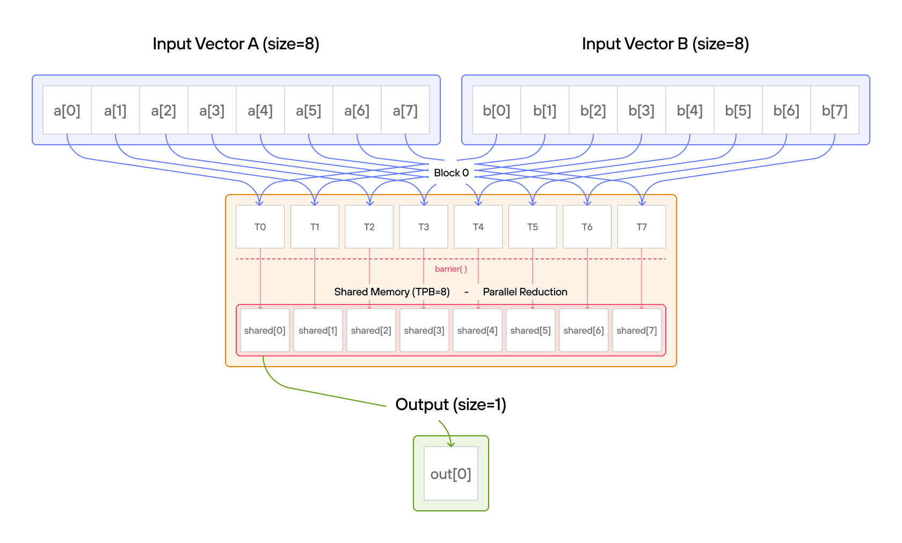
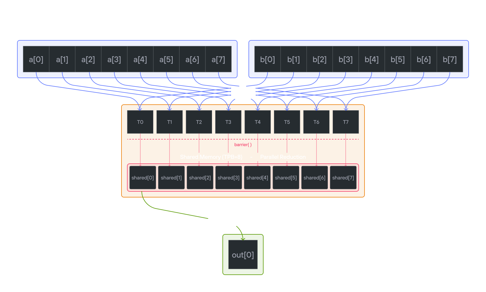

# Puzzle 12: Dot Product

## Overview

Implement a kernel that computes the dot product of 1D TileTensor `a` and 1D TileTensor `b` and stores it in 1D TileTensor `output` (single number).  The dot product is an operation that takes two vectors of the same size and returns a single number (a scalar). It is calculated by multiplying corresponding elements from each vector and then summing those products.

For example, if you have two vectors:

\\[a = [a_{1}, a_{2}, ..., a_{n}] \\]
\\[b = [b_{1}, b_{2}, ..., b_{n}] \\]

​Their dot product is:
\\[a \\cdot b = a_{1}b_{1} +  a_{2}b_{2} + ... + a_{n}b_{n}\\]

**Note:** _You have 1 thread per position. You only need 2 global reads per thread and 1 global write per thread block._




## Key concepts

**Parallel reduction** is an algorithm that combines \\(n\\) values into one using a binary operation (here, addition) in \\(O(\log n)\\) steps instead of \\(O(n)\\) sequential steps. In each step, half the active threads each add one value into another, halving the number of remaining partial results. After \\(\log_2 n\\) steps, thread 0 holds the final sum. This tree-shaped computation requires a `barrier()` between steps so no thread reads a partially-updated value.

This puzzle covers:

- Similar to [puzzle 8](../puzzle_08/puzzle_08.md) and [puzzle 11](../puzzle_11/puzzle_11.md), implementing parallel reduction with TileTensor
- Managing shared memory using TileTensor with address_space
- Coordinating threads for collective operations
- Using layout-aware tensor operations

The key insight is how TileTensor simplifies memory management while maintaining efficient parallel reduction patterns.

## Configuration

- Vector size: `SIZE = 8` elements
- Threads per block: `TPB = 8`
- Number of blocks: 1
- Output size: 1 element
- Shared memory: `TPB` elements

Notes:

- **TileTensor allocation**: Use `stack_allocation[dtype=dtype, address_space=AddressSpace.SHARED](row_major[TPB]())`
- **Element access**: Natural indexing with bounds checking
- **Layout handling**: Separate layouts for input and output
- **Thread coordination**: Same synchronization patterns with `barrier()`

## Code to complete

```mojo
{{#include ../../../problems/p12/p12.mojo:dot_product}}
```

<a href="{{#include ../_includes/repo_url.md}}/blob/main/problems/p12/p12.mojo" class="filename">View full file: problems/p12/p12.mojo</a>

<details>
<summary><strong>Tips</strong></summary>

<div class="solution-tips">

1. Create shared memory with TileTensor using address_space
2. Store `a[global_i] * b[global_i]` in `shared[local_i]`
3. Use parallel reduction pattern with `barrier()`
4. Let thread 0 write final result to `output[0]`

</div>
</details>

## Running the code

To test your solution, run the following command in your terminal:

<div class="code-tabs" data-tab-group="package-manager">
  <div class="tab-buttons">
    <button class="tab-button">pixi NVIDIA (default)</button>
    <button class="tab-button">pixi AMD</button>
    <button class="tab-button">pixi Apple</button>
    <button class="tab-button">uv</button>
  </div>
  <div class="tab-content">

```bash
pixi run p12
```

  </div>
  <div class="tab-content">

```bash
pixi run -e amd p12
```

  </div>
  <div class="tab-content">

```bash
pixi run -e apple p12
```

  </div>
  <div class="tab-content">

```bash
uv run poe p12
```

  </div>
</div>

Your output will look like this if the puzzle isn't solved yet:

```txt
out: HostBuffer([0.0])
expected: HostBuffer([140.0])
```

## Solution

<details class="solution-details">
<summary></summary>

```mojo
{{#include ../../../solutions/p12/p12.mojo:dot_product_solution}}
```

<div class="solution-explanation">

The solution implements a parallel reduction for dot product using TileTensor. Here's the detailed breakdown:

### Phase 1: Element-wise Multiplication

Each thread performs one multiplication with natural indexing:

```mojo
shared[local_i] = a[global_i] * b[global_i]
```

### Phase 2: Parallel Reduction

Tree-based reduction with layout-aware operations:

```txt
Initial:  [0*0  1*1  2*2  3*3  4*4  5*5  6*6  7*7]
        = [0    1    4    9    16   25   36   49]

Step 1:   [0+16 1+25 4+36 9+49  16   25   36   49]
        = [16   26   40   58   16   25   36   49]

Step 2:   [16+40 26+58 40   58   16   25   36   49]
        = [56   84   40   58   16   25   36   49]

Step 3:   [56+84  84   40   58   16   25   36   49]
        = [140   84   40   58   16   25   36   49]
```

### Key implementation features

1. **Memory Management**:
   - Clean shared memory allocation with TileTensor address_space parameter
   - Type-safe operations with TileTensor
   - Automatic bounds checking
   - Layout-aware indexing

2. **Thread Synchronization**:
   - `barrier()` after initial multiplication
   - `barrier()` between reduction steps
   - Safe thread coordination

3. **Reduction Logic**:

   ```mojo
   stride = TPB // 2
   while stride > 0:
       if local_i < stride:
           shared[local_i] += shared[local_i + stride]
       barrier()
       stride //= 2
   ```

4. **Performance Benefits**:
   - \\(O(\log n)\\) time complexity
   - Coalesced memory access
   - Minimal thread divergence
   - Efficient shared memory usage

The TileTensor version maintains the same efficient parallel reduction while providing:

- Better type safety
- Cleaner memory management
- Layout awareness
- Natural indexing syntax

### Barrier synchronization importance

The `barrier()` between reduction steps is critical for correctness. Here's why:

Without `barrier()`, race conditions occur:

```text
Initial shared memory: [0 1 4 9 16 25 36 49]

Step 1 (stride = 4):
Thread 0 reads: shared[0] = 0, shared[4] = 16
Thread 1 reads: shared[1] = 1, shared[5] = 25
Thread 2 reads: shared[2] = 4, shared[6] = 36
Thread 3 reads: shared[3] = 9, shared[7] = 49

Without barrier:
- Thread 0 writes: shared[0] = 0 + 16 = 16
- Thread 1 starts next step (stride = 2) before Thread 0 finishes
  and reads old value shared[0] = 0 instead of 16!
```

With `barrier()`:

```text
Step 1 (stride = 4):
All threads write their sums:
[16 26 40 58 16 25 36 49]
barrier() ensures ALL threads see these values

Step 2 (stride = 2):
Now threads safely read the updated values:
Thread 0: shared[0] = 16 + 40 = 56
Thread 1: shared[1] = 26 + 58 = 84
```

The `barrier()` ensures:

1. All writes from current step complete
2. All threads see updated values
3. No thread starts next iteration early
4. Consistent shared memory state

Without these synchronization points, we could get:

- Memory race conditions
- Threads reading stale values
- Non-deterministic results
- Incorrect final sum

</div>
</details>
